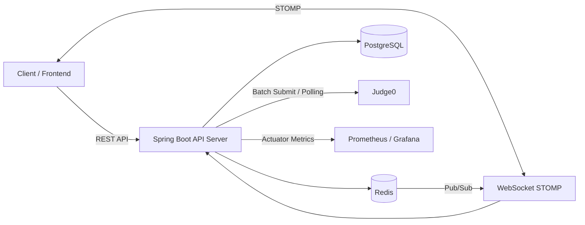

# Code Battle Backend

실시간 코딩 배틀과 개인 문제 풀이를 지원하는 알고리즘 학습 플랫폼 백엔드입니다.

사용자는 문제를 조회하고 코드를 실행/제출할 수 있으며, 매칭 또는 방 입장을 통해 다른 사용자와 실시간 코딩 배틀을 진행할 수 있습니다. 백엔드는 JWT 인증, Redis 기반 상태 관리, WebSocket 실시간 이벤트, Judge0 코드 실행/채점, 배틀 정산, 랭킹/레이팅, 모니터링과 부하 테스트 환경을 제공합니다.

**서비스 URL**: https://www.the-bracket.site

## 프로젝트 개요

| 항목 | 내용 |
| --- | --- |
| 프로젝트 유형 | 팀 프로젝트 / 백엔드 |
| 핵심 도메인 | 알고리즘 문제 풀이, 실시간 코딩 배틀, 코드 채점 |
| 주요 기술 | Java 21, Spring Boot 3.5, JPA, Spring Security, WebSocket, Redis, PostgreSQL, Judge0 |
| 품질 관리 | JUnit 5, Testcontainers, JaCoCo, Spotless, GitHub Actions |
| 운영/관측 | Actuator, Prometheus, Grafana, k6 |

## 주요 기능

### 인증/회원

- 회원가입, 로그인, 로그아웃
- JWT Access Token / Refresh Token 기반 인증
- WebSocket 연결용 토큰 발급
- 내 정보, 배틀 결과, 레이팅 변화, 풀이 히트맵 조회

### 문제 풀이

- 문제 목록/상세 조회
- 관리자 문제 등록/수정/검증/일괄 등록
- 태그 및 난이도 기반 문제 메타데이터 제공
- 샘플 테스트케이스 실행
- 전체 테스트케이스 제출 및 결과 저장
- 개인 풀이용 Solo Run / Solo Submission

### 실시간 배틀

- 배틀룸 생성 및 입장
- 전원 입장 시 배틀 시작 이벤트 발행
- 배틀 중 코드 제출, 채점 결과, 참가자 상태를 WebSocket으로 동기화
- 관전자용 코드 스트림 제공
- 배틀 종료 후 순위, 점수 변화, 제출 결과 조회
- 중도 이탈, 재접속, 타임아웃, 미확인 결과 조회 처리

### 매칭

- 난이도 기반 매칭 큐 참가/취소
- 매칭 수락/거절
- Redis 기반 매칭 상태 저장소
- 매칭 이벤트 발행

### 랭킹/복습

- 사용자 랭킹 대시보드
- 레이팅 프로필과 티어 정책
- 풀이 이력 기반 복습 일정 조회 및 dismiss 처리

## 기술 스택

| 구분 | 기술 |
| --- | --- |
| Language | Java 21 |
| Framework | Spring Boot 3.5, Spring Web, Spring Security, Spring Batch |
| Persistence | Spring Data JPA, PostgreSQL, pgvector |
| Cache/Queue | Redis, Redisson |
| Realtime | WebSocket, STOMP, Redis Pub/Sub |
| Judge | Judge0 |
| API Docs | Springdoc OpenAPI / Swagger UI |
| Test | JUnit 5, Spring Boot Test, Spring Security Test, Testcontainers |
| Quality | JaCoCo, Spotless |
| Infra | Docker, Docker Compose, GitHub Actions |
| Monitoring | Actuator, Prometheus, Grafana, k6 |

## 시스템 구조



## 핵심 구현 포인트

### 1. Judge0 기반 비동기 채점

코드 제출 요청이 들어오면 `Submission`을 먼저 저장하고, Judge0 Batch API에 테스트케이스 단위로 실행 요청을 보냅니다. 이후 비동기 스레드에서 폴링으로 결과를 수집하고, `AC`, `WA`, `TLE`, `CE`, `RE` 우선순위에 따라 최종 제출 결과를 집계합니다.

- 제출 API는 즉시 `JUDGING` 상태를 반환해 사용자 요청 지연을 줄임
- Judge0 결과 수신 후 DB 저장과 WebSocket 결과 알림 수행
- 배틀 제출과 개인 풀이 제출을 분리하면서도 공통 실행 로직은 `Judge0ExecutionService`로 추출

### 2. 실시간 배틀 상태 동기화

배틀룸에서는 참가자의 입장, 제출, 정답 처리, 이탈, 재입장, 종료 상태가 실시간으로 공유되어야 합니다. 이를 위해 WebSocket 이벤트를 도메인 이벤트와 트랜잭션 커밋 이후 발행 흐름으로 정리했습니다.

- `/topic/room/{roomId}`: 배틀 이벤트 채널
- `/topic/room/{roomId}/spectate`: 관전자용 코드 스트림
- `/topic/user/{memberId}/battle`: 개인 배틀 결과 알림
- 주요 상태 변경 이벤트는 DB 커밋 이후 발행해 데이터와 화면 상태 불일치를 줄임

### 3. 배틀 정산과 동시성 제어

배틀은 전원 정답, 전원 이탈, 타이머 만료 등 여러 종료 조건으로 정산될 수 있습니다. 마지막 제출과 타이머 만료가 동시에 발생해도 중복 정산이 일어나지 않도록 idempotent 체크와 트랜잭션 경계를 정리했습니다.

- `FINISHED` 상태 체크로 중복 정산 1차 차단
- `BattleSettlementExecutor`를 별도 트랜잭션으로 분리해 `AFTER_COMMIT` 이후에도 DB 반영 보장
- `@Version` 기반 낙관적 락으로 정산 race condition 방어
- `SOLVED`, `ABANDONED`, `TIMEOUT`, `QUIT` 상태를 분리해 종료 사유를 명확히 표현

### 4. Redis 기반 배틀 상태 관리

Redis는 단순 캐시가 아니라 실시간 배틀 운영에 필요한 상태 저장과 메시지 전달 인프라로 사용했습니다.

- Redis Pub/Sub으로 WebSocket 메시지를 멀티 인스턴스 환경에서도 전달
- Redisson DelayedQueue로 재접속 grace period와 배틀 타이머 처리
- StringRedisTemplate TTL로 WebSocket 토큰과 관전자 코드 스냅샷 관리
- Redis 장애가 핵심 정산 실패로 이어지지 않도록 DB 정산 로직과 Redis 보조 흐름을 분리

### 5. 관측과 품질 관리

개발 후 기능 검증에 그치지 않고 운영 관측과 테스트 품질을 함께 구성했습니다.

- Actuator + Prometheus + Grafana 기반 HTTP/JVM 메트릭 수집
- k6 smoke/load/spike 테스트 스크립트 작성
- JaCoCo 리포트를 PR 댓글로 자동 게시
- Spotless와 GitHub Actions로 포맷/빌드/테스트 자동 검증
- Testcontainers로 PostgreSQL/Redis 통합 테스트 환경 구성

## 담당 역할

팀 프로젝트에서 저는 주로 **실시간 배틀 도메인, Judge0 채점 흐름, WebSocket 상태 동기화, 배틀 종료/정산 안정화, 품질 자동화**를 담당했습니다.

### 배틀룸 생성/입장 흐름 구현

- 배틀룸 생성 API 구현
- 참가자 목록 기반 `BattleParticipant` 생성
- 4명 입장 시 배틀 상태를 `PLAYING`으로 전환하고 `BATTLE_STARTED` 이벤트 발행
- 동시 입장 요청에서 상태 불일치가 발생하지 않도록 비관적 락과 명시적 저장 흐름 보강

관련 PR:

- [#27 방 생성 api](https://github.com/prgrms-be-devcourse/NBE8-10-final-Team01/pull/27)
- [#33 방입장api](https://github.com/prgrms-be-devcourse/NBE8-10-final-Team01/pull/33)

### 제출/채점/Judge0 연동 구현

- 배틀 코드 제출 API 구현
- 제출 저장 후 WebSocket으로 제출 결과 브로드캐스트
- Judge0 Batch API 기반 비동기 채점 구현
- 샘플 실행 `Run`과 실제 제출 `Submit` 흐름 분리
- Solo Run / Solo Submission 도메인 추가
- Judge0 실행 공통 로직 추출

관련 PR:

- [#39 코드 제출 api && 브로드캐스트](https://github.com/prgrms-be-devcourse/NBE8-10-final-Team01/pull/39)
- [#66 채점](https://github.com/prgrms-be-devcourse/NBE8-10-final-Team01/pull/66)
- [#74 run 기능 추가](https://github.com/prgrms-be-devcourse/NBE8-10-final-Team01/pull/74)
- [#76 solo run과 submission](https://github.com/prgrms-be-devcourse/NBE8-10-final-Team01/pull/76)

### 실시간 코드 공유와 배틀 결과 정산

- 참가자 코드 변경을 관전자 채널로 실시간 전달
- `BATTLE_FINISHED` 이후 최종 순위/점수/제출 결과 조회 API 구현
- 정답 여부, 풀이 시간, 오답 패널티를 반영한 순위 산정
- 타이머 만료 시 자동 정산 흐름 추가
- 중복 정산 방지 로직 설계

관련 PR:

- [#48 실시간 코드 공유, 순위 계산, 점수 반영, 결과 저장](https://github.com/prgrms-be-devcourse/NBE8-10-final-Team01/pull/48)

### Redis Pub/Sub 기반 멀티인스턴스 대응

- Spring EC2 2대 환경에서 서버마다 독립된 STOMP 인메모리 브로커가 배틀 이벤트를 공유하지 못하는 문제 발견
- Redis Pub/Sub으로 전환해 어느 서버 인스턴스로 요청이 들어와도 배틀 이벤트가 모든 구독자에게 전달되도록 개선
- 관전 기능의 코드 스냅샷 채널도 동일 구조로 개선

관련 PR:

- [#123 멀티인스턴스 대비 redis pub/sub적용, 관전 개선](https://github.com/prgrms-be-devcourse/NBE8-10-final-Team01/pull/123)

### 동시성/데이터 정합성 개선

- 한 사용자가 복수 배틀에 동시에 `PLAYING` 상태로 등록될 수 있는 문제를 발견
- PostgreSQL partial unique index로 `PLAYING` 상태에 한해 사용자별 단일 배틀 참여를 보장
- `joinRoom` 동시 요청은 비관적 락으로 직렬화하고, 락 타임아웃 시 409 응답을 반환하도록 처리
- `TransactionSynchronizationManager.afterCommit()`으로 배틀 시작/종료 WebSocket 메시지를 DB 커밋 이후 발행하도록 수정 — 클라이언트 결과 조회 시 데이터 불일치 문제 해소
- Redis DelayedQueue 기반 배틀 타이머 구조 개선
- 배틀 정산은 idempotent 체크와 낙관적 락으로 중복 실행을 방어

관련 PR:

- [#83 websocket 메시지를 트랜잭션 커밋 전에 전송하는 문제 수정](https://github.com/prgrms-be-devcourse/NBE8-10-final-Team01/pull/83)
- [#105 한 사용자가 2개의 방에 PLAYING중일 수 있는 문제 수정](https://github.com/prgrms-be-devcourse/NBE8-10-final-Team01/pull/105)
- [#163 방 생성과 종료 개선](https://github.com/prgrms-be-devcourse/NBE8-10-final-Team01/pull/163)

### WebSocket 보안과 참가자 상태 동기화

- 배틀 이벤트 채널은 방 참가자만 구독 가능하도록 인터셉터 추가
- 관전자 채널은 공개 유지해 역할별 접근 범위 분리
- `PARTICIPANT_STATUS_CHANGED` 이벤트 추가
- `PLAYING`, `SOLVED`, `ABANDONED`, `TIMEOUT`, `QUIT` 상태 변경을 참가자/관전자에게 공통 전달
- WebSocket 보안 설정 추가

관련 PR:

- [#155 battleRoom에는 해당 room 참가자만 참여 가능하도록 함](https://github.com/prgrms-be-devcourse/NBE8-10-final-Team01/pull/155)
- [#168 webSocketSecurityConfig추가](https://github.com/prgrms-be-devcourse/NBE8-10-final-Team01/pull/168)
- [#190 battleroom의 participants 상태 실시간 동기화](https://github.com/prgrms-be-devcourse/NBE8-10-final-Team01/pull/190)

### 배틀 종료/재접속/공정성 개선

- 방 이탈 및 재입장 초기 구현
- 중도 퇴장 및 진행 중 배틀룸 목록 조회 API 구현
- 네트워크 이탈 후 15초 grace period 동안 즉시 이탈 표시를 하지 않도록 UX 개선
- grace 만료 후에만 `ABANDONED` 상태를 공개하도록 이벤트 시점 정리
- 재입장 시 idempotent하게 `PLAYING` 상태 이벤트 발행

관련 PR:

- [#89 방 이탈과 재입장](https://github.com/prgrms-be-devcourse/NBE8-10-final-Team01/pull/89)
- [#118 중도 퇴장 & 진행 중 방 조회 구현](https://github.com/prgrms-be-devcourse/NBE8-10-final-Team01/pull/118)
- [#144 이탈과 재입장 그리고 이탈 시 grace period 도입](https://github.com/prgrms-be-devcourse/NBE8-10-final-Team01/pull/144)
- [#208 battleRoom 이탈 관련 grace period 개선](https://github.com/prgrms-be-devcourse/NBE8-10-final-Team01/pull/208)

### 문서화/품질 자동화

- 프로젝트 초기 CI 세팅
- Swagger UI 추가
- JaCoCo 테스트 커버리지 리포트 자동 댓글 구성
- PR 단위 품질 확인 흐름 개선

관련 PR:

- [#3 project 기본 세팅](https://github.com/prgrms-be-devcourse/NBE8-10-final-Team01/pull/3)
- [#205 swagger 추가](https://github.com/prgrms-be-devcourse/NBE8-10-final-Team01/pull/205)
- [#207 jacoco 커밋메시지 추가](https://github.com/prgrms-be-devcourse/NBE8-10-final-Team01/pull/207)

### 진행 중 개선

- Judge0 큐 대기 시간과 polling 지연이 순위에 영향을 주지 않도록 AC 기준 시각을 "채점 완료 감지 시각"에서 "제출 생성 시각"으로 변경

관련 PR (진행 중):

- [#215 순위 공정성 문제 해결](https://github.com/prgrms-be-devcourse/NBE8-10-final-Team01/pull/215)

## API 요약

| 도메인 | Method | Endpoint | 설명 |
| --- | --- | --- | --- |
| Auth | POST | `/api/v1/auth/reissue` | Access Token 재발급 |
| Member | POST | `/api/v1/members/join` | 회원가입 |
| Member | POST | `/api/v1/members/login` | 로그인 |
| Member | GET | `/api/v1/members/me` | 내 정보 조회 |
| Problem | GET | `/api/v1/problems` | 문제 목록 조회 |
| Problem | GET | `/api/v1/problems/{problemId}` | 문제 상세 조회 |
| Problem | POST | `/api/v1/admin/problems` | 관리자 문제 등록 |
| Run | POST | `/api/v1/run` | 배틀 샘플 실행 |
| Submission | POST | `/api/v1/submissions` | 배틀 제출 |
| Solo | POST | `/api/v1/solo/run` | 개인 풀이 샘플 실행 |
| Solo | POST | `/api/v1/solo/submissions` | 개인 풀이 제출 |
| Battle | POST | `/api/v1/battle/rooms` | 배틀룸 생성 |
| Battle | POST | `/api/v1/battle/rooms/{roomId}/join` | 배틀룸 입장 |
| Battle | GET | `/api/v1/battle/rooms/{roomId}/state` | 배틀룸 상태 조회 |
| Battle | POST | `/api/v1/battle/rooms/{roomId}/exit` | 배틀룸 나가기 |
| Battle | GET | `/api/v1/battle/rooms/{roomId}/result` | 배틀 결과 조회 |
| Matching | POST | `/api/v2/queue/join` | 매칭 큐 참가 |
| Matching | DELETE | `/api/v2/queue/cancel` | 매칭 취소 |
| Matching | POST | `/api/v2/matches/{matchId}/accept` | 매칭 수락 |
| Ranking | GET | `/api/v1/rankings/me/dashboard` | 내 랭킹 대시보드 |
| Review | GET | `/api/v1/review/today` | 오늘의 복습 조회 |

## 로컬 실행

### 1. 환경 변수 설정

`.env.example`을 참고해 `.env` 파일을 생성합니다.

```properties
DB_HOST=localhost
DB_PORT=5432
DB_NAME=back
DB_USERNAME=back
DB_PASSWORD=change-this-local-password
JUDGE0_EC2_IP=NEED_TO_SET
```

### 2. PostgreSQL / Redis 실행

```bash
docker compose up -d
```

### 3. 애플리케이션 실행

```bash
./gradlew bootRun
```

### 4. Swagger 확인

```text
http://localhost:8080/swagger-ui/index.html
```

## 테스트와 검증

```bash
./gradlew test
./gradlew build
./gradlew spotlessCheck
```

JaCoCo 리포트는 테스트 실행 후 아래 경로에서 확인할 수 있습니다.

```text
build/reports/jacoco/test/html/index.html
```

## 모니터링과 부하 테스트

Actuator Prometheus endpoint:

```text
http://localhost:8080/actuator/prometheus
```

k6 실행:

```bash
k6 run k6/smoke.js
k6 run k6/load.js
k6 run k6/spike.js
```

자세한 내용은 아래 문서를 참고합니다.

- [monitoring-k6-guide.md](docs/monitoring-k6-guide.md)
- [local-db-compose-guide.md](docs/local-db-compose-guide.md)
- [judge0-Self-host.md](docs/judge0-Self-host.md)
- [rds-problem-load-and-translation.md](docs/rds-problem-load-and-translation.md)

## 프로젝트를 통해 배운 점

- 실시간 서비스에서는 DB 상태 변경과 WebSocket 이벤트 발행 시점이 어긋나면 사용자 화면과 실제 데이터가 쉽게 불일치한다는 점을 경험했고, 이를 `afterCommit` 기준으로 정리했습니다.
- 배틀 정산처럼 여러 경로에서 동시에 실행될 수 있는 로직은 단순 조건문만으로 부족하며, idempotent 설계와 트랜잭션 경계, 락 전략이 함께 필요하다는 점을 배웠습니다.
- Redis를 캐시뿐 아니라 Pub/Sub, DelayedQueue, TTL 저장소로 활용하면서 실시간 서비스에서 Redis가 어떤 역할을 할 수 있는지 익혔습니다.
- Judge0 같은 외부 실행 시스템을 연동할 때는 큐 대기 시간과 polling 지연이 서비스 공정성에 영향을 줄 수 있음을 확인했고, 순위 기준 시각을 제출 시각으로 보정하는 작업을 진행하고 있습니다.
- 기능 구현 이후에도 테스트, 커버리지, 모니터링, 부하 테스트 문서화까지 이어져야 포트폴리오로 설명 가능한 백엔드 경험이 된다는 점을 체감했습니다.
